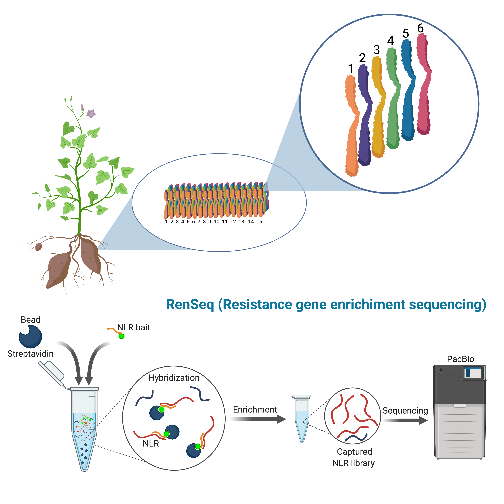
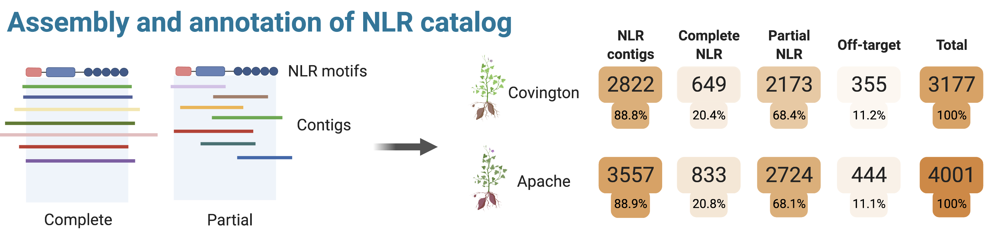

------

Cultivated for its nutritious roots, sweetpotato (*Ipomoea batatas*) is an important staple crop in the tropics, especially in Sub-Saharan Africa, Central America and New Guinea. Sweetpotatoes are highly susceptible to diverse pathogens in the field and postharvest. Breeding sweetpotatoes for resistance remains puzzling due to limited knowledge on the genetic basis of resistance and the hexaploid nature of the crop. Plant intracellular immune receptors known as nucleotide-binding domain leucine-rich repeat receptors (NLR) represent a key component of the plant immune system by mediating plant immune response to pathogen threats. Here, we aimed to catalog NLR diversity in historical (Apache) and contemporary (Covington) sweetpotato cultivars. We used resistance gene enrichment sequencing (RenSeq), a genome reduction approach, to capture and sequence full NLRs. 

A custom designed NLR bait-library of 2,034 targets allowed us to enrich NLR genes with 88% target capture rate. Using PacBio sequencing after RenSeq on genomic DNA, we identified 649 and 833 complete NLRs for Covington and Apache, respectively. 

