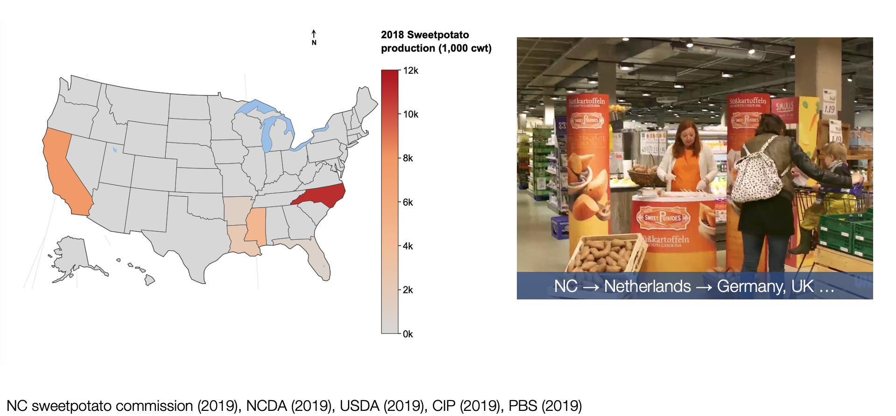
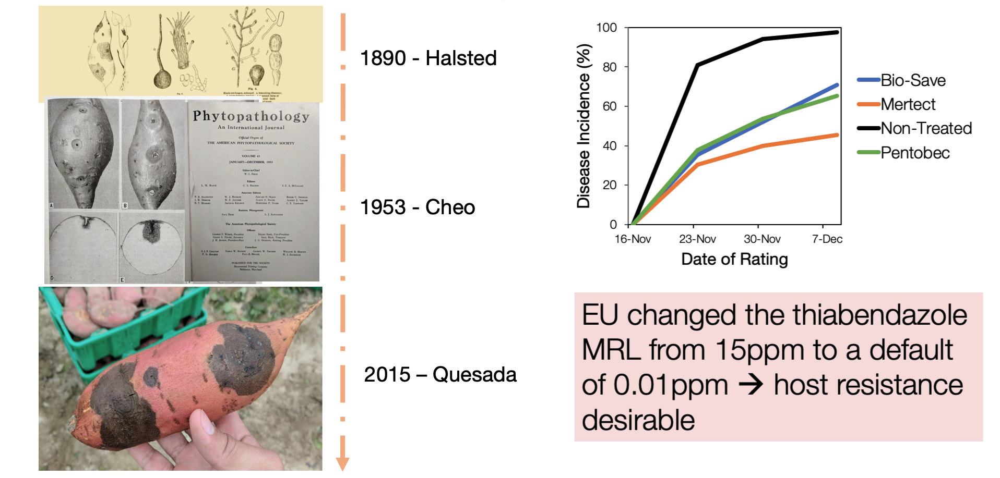
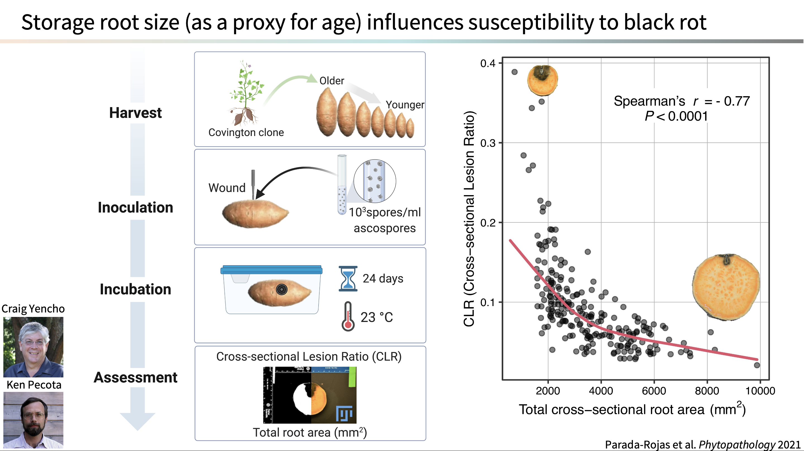

------

The United States (US) exports ~44% of sweetpotatoes in the global export market annually, and North Carolina (NC) produces >60% of sweetpotatoes grown in the US. Higher market prices abroad motivate NC sweetpotato growers to export their crop. 

*Ceratocystis fimbriata*, a hemibiotroph fungal pathogen once controlled with cultural practices, has re-emerged and remains an important threat to sweetpotato. The European Union (EU) recently changed the thiabendazole (marketed as Mertect) Maximum Residue Level (MRL) from 15ppm to a default of 0.01ppm. Fungicide restrictions combined with intrinsic risks in the production line (wounds, insects, and infested water) limit available disease control options for exporters making host resistance desirable.

Sweetpotatoes are sold in three sizes representing different developmental stages (Canners, No.1, and Jumbo) depending on the target market. Little is known about the influence of sweetpotato development stage in disease susceptibility. We found that CLR (Cross-sectional lesion ratio) values are associated with total area of storage root suggesting age-related resistance. 

#### What are the implications of this research?

Timely fungicide applications could protect slips and developing storage roots in fields with history of *C. fimbriata*. Applications at transplanting and early storage root development could potentially prevent *C. fimbriata* infection in combination with pathogen-free seed.

