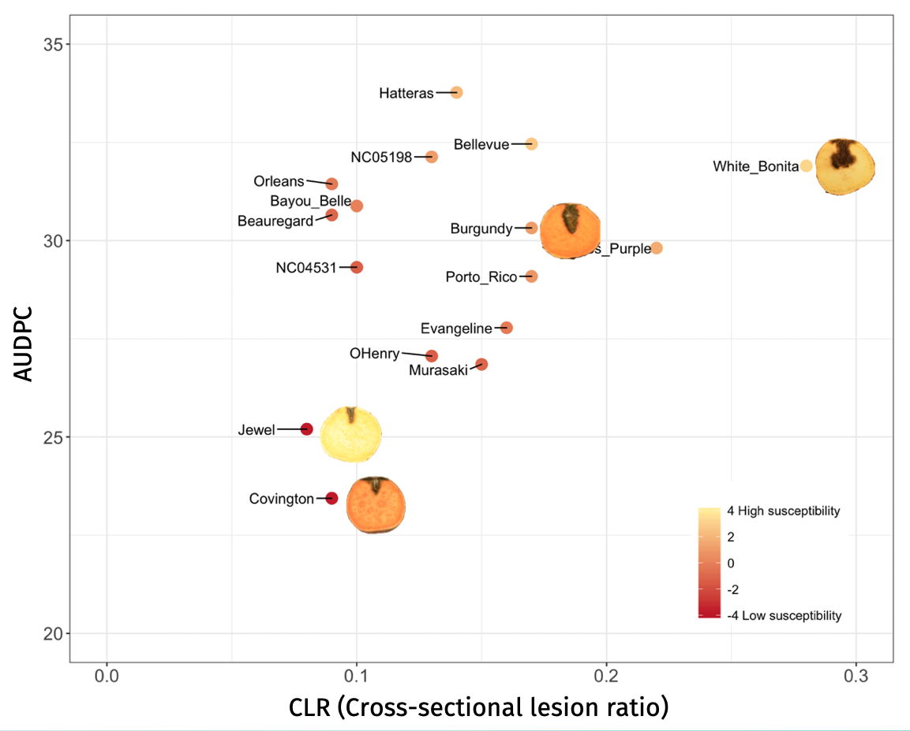
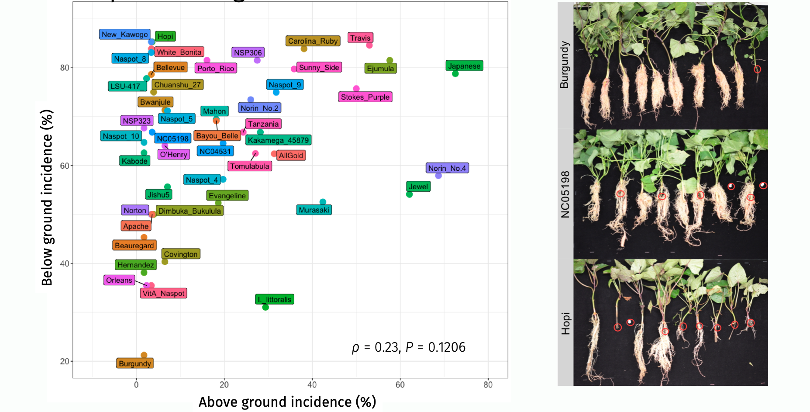
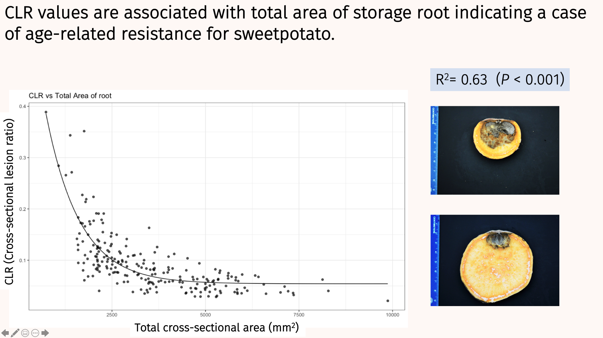

------
------

In North Carolina, sweetpotato has become one of the most economically important crops as NC produces more than half of the US sweetpotatoes. Around 44% of exports globally come from just a few counties in North Carolina. Farmers are motivated to sell their sweet potatoes in the European food market because of the higher market prices. Roots are shipped from Wilmington NC to the Netherlands where they are marketed through the EU. 

The fungus *Ceratocystis fimbriata*, a pathogen once controlled via cultural practices, has re-emerged and remains an important thread to US sweetptoato industry. 

Back in 1943, progress was made to control this disease. However, more than 60 years forward *C. fimbrriata* remains a threat. Black concentric lesions in sweetpotato skin make the roots unmarkatable. The fungus produces sticky and sweet smelly ascospores that attract insects and help with spread of the fungus through packing houses.    

In the vegetable pathology lab, we have tested several fungicide products for control of black rot. Despite Mertect (Thiabendazole) effectively controls black rot at postharvest, [the EU legislation restricts its use to control at postharverst if they are intented for export market](https://plantpathology.ces.ncsu.edu/2019/04/renewal-of-section-18-label-for-use-of-mertect-thiabendazole-in-sweetpotato-postharvest-for-black-rot-control-in-domestic-markets-has-been-approved/). Other managment strategies are required and that is where my research fits!

Through my PhD research we have tested cultivated sweetpotato, wild relatives, and advance breeding lines for resistance to black rot. Root phenotyping experiments indicate susceptibility across accessions tested with some ranking lower for CLR and AUDPC values.

We also examined resistance at the sweetpotato slip level. This is where we started think that resistance maybe associated with a developmental stage of the roots, since the slip assay contradicted the storage root experiments. 

Recently, I discovered that resistance maybe associated with root development $R^2$= 0.63. This work is currently in preparation for publication!

