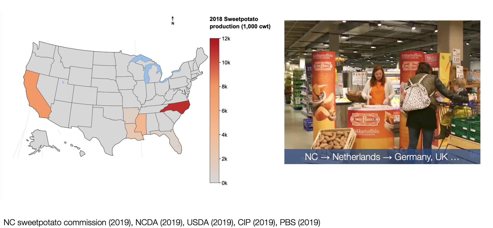
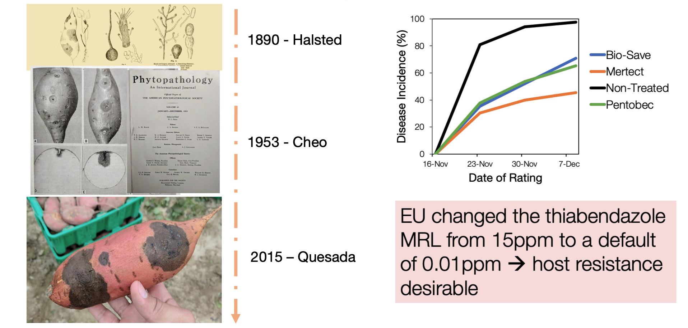

------

The United States (US) exports ~44% of sweetpotatoes in the global export market annually, and North Carolina (NC) produces >50% of sweetpotatoes grown in the US. Higher market prices abroad motivate NC sweetpotato growers to export their crop. 

*Ceratocystis fimbriata*, a hemibiotroph fungal pathogen once controlled with cultural practices, has re-emerged and remains an important threat to sweetpotato. The European Union (EU) recently changed the thiabendazole (marketed as Mertect) Maximum Residue Level (MRL) from 15ppm to a default of 0.01ppm. Fungicide restrictions combined with intrinsic risks in the production line (wounds, insects, and infested water) limit available disease control options for exporters making host resistance desirable.

Sweetpotatoes are sold in three sizes representing different developmental stages (Canners, No.1, and Jumbo) depending on the target market. Little is known about the influence of sweetpotato development stage in disease susceptibility. Here, we examine cytological changes at different developmental stages using X-ray computed tomography. We hypothesize that the storage root cambium cells act as a barrier during *C. fimbriata* infection.

We found that CLR values are associated with total area of storage root suggesting age-related resistance. Surface lesion diameter has no correlation with storage root area indicating no age-related effect for this trait.

The computed tomography scan suggests that the Jumbo storage root cambium serves as a barrier for C. fimbriata inner colonization. This high-density region is underdeveloped in the Canner storage root. Our proof of concept experiment potentially highlights the presence of abundant perithecia in Canner roots that are absent in Jumbo roots.

