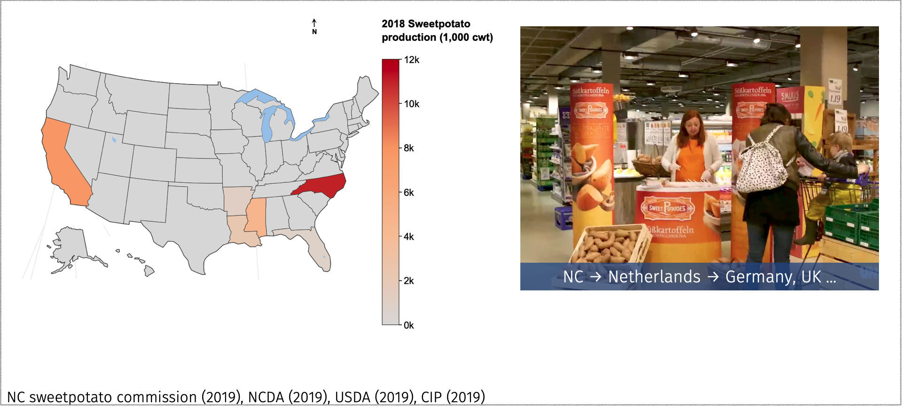

[black_rot]

In North Carolina, sweetpotato has become one of the most economically important crops as NC produces more than half of the US sweetpotatoes. Around 44% of exports globally come from just a few counties in North Carolina. Farmers are motivated to sell their sweet potatoes in the European food market because of the higher market prices. Roots are shipped from Wilmington NC to the Netherlands where they are marketed through the EU. 

The fungus *Ceratocystis fimbriata*, a pathogen once controlled via cultural practices, has re-emerged and remains an important thread to US sweetptoato industry. 

