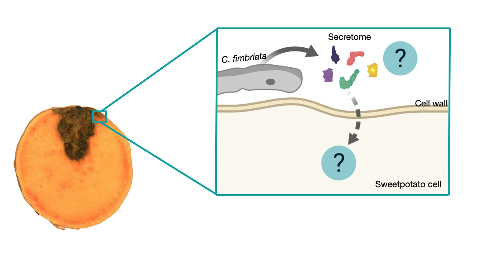

### In this project we want to answer the following questions:

#### How does *C. fimbriata* modulate effectors/elicitors during infection?

#### How does *C. fimbriata* secretome adapts to infect root vs slips?

#### Is there any transcriptional reprograming in sweetpotato when infected by *C. fimbriata?* -At different time points -Plant tissues -Cultivars

