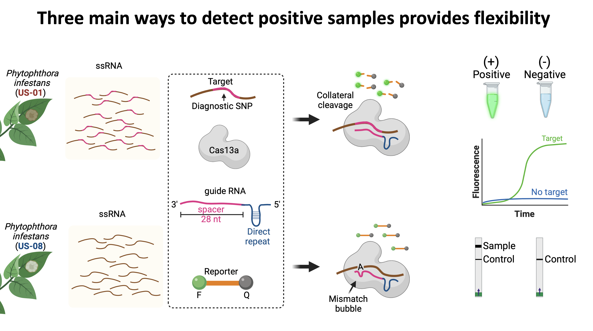

------

CRISPR-based diagnostics offer a rapid and precise method to detect plant pathogens. Our project focuses on designing species- and lineage-specific CRISPR-Dx assays for *Phytophthora infestans* and *Agrobacterium*. These tools aim to provide proof of concept for in-field molecular diagnostics, enabling growers and researchers to quickly identify and manage outbreaks.

By analyzing pathogen genomes, I designed guide RNAs containing diagnostic regions with single-nucleotide specificity to detect unique variants while avoiding cross-reactivity. These guides are currently being validated in lab experiments to ensure specificity and sensitivity. CRISPR diagnostic tools can revolutionize disease scouting by providing portable, cost-effective, and rapid detection directly in the field.
