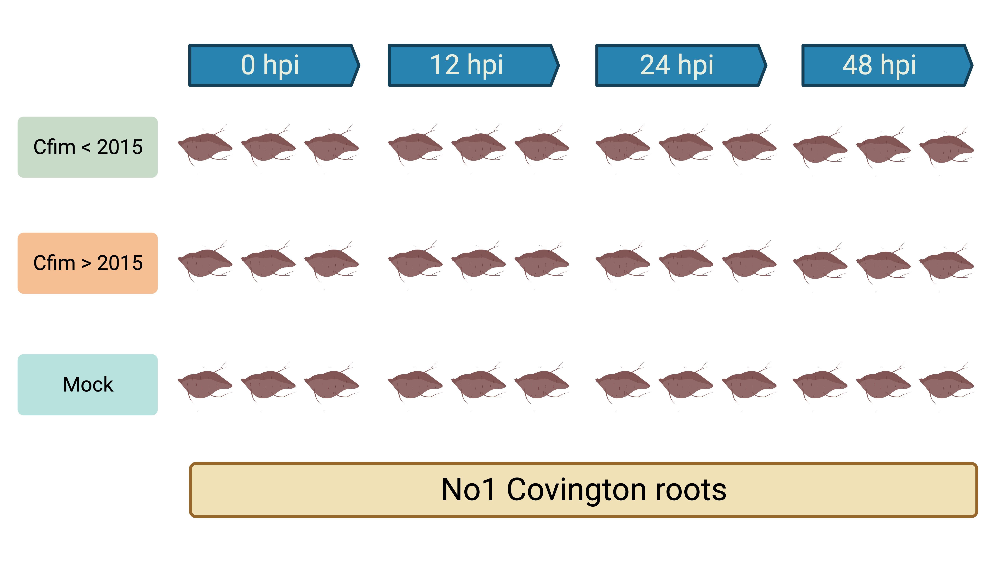

------

Recently, a study employing a comparative genomic approach compared the genome of *C. fimbriata* with *C. manginecans* revealing differences in effector clustering among transposable elements[12](https://www.sciencedirect.com/science/article/abs/pii/S1087184520301249). However, this study only reported the presence of effectors in single isolates without characterizing their expression pattern in the host or understanding if these effectors were ‘core’, conserved in each species and likely playing a role in infection. There is a critical need to understand the expression patterns of effectors during infection in multiple isolates to reveal the core effector repertoire in *C. fimbriata*. My preliminary research revealed a pattern of widespread susceptibility among cultivated sweetpotato accessions[13](https://pubmed.ncbi.nlm.nih.gov/33534610/). The absence of complete resistance in storage roots for cultivated sweetpotatoes warrants further research to accelerate the screening of a wide and diverse germplasm collection. To identify the effector repertoire of *C. fimbriata*, we generated hybrid PacBio and Illumina *de novo* genome assemblies for two NC *C. fimbirata* isolates with different temporal relevance (pre- and post-epidemic). Several critical questions remain unanswered for *C. fimbriata*: How does *C. fimbriata* modulate effectors during infection? Does *C. fimbriata* employ a core effector repertoire to successfully infect susceptible sweetpotatoes? Is there any significant effector expression difference between pre- and post-epidemic *C. fimbriata* isolates?

