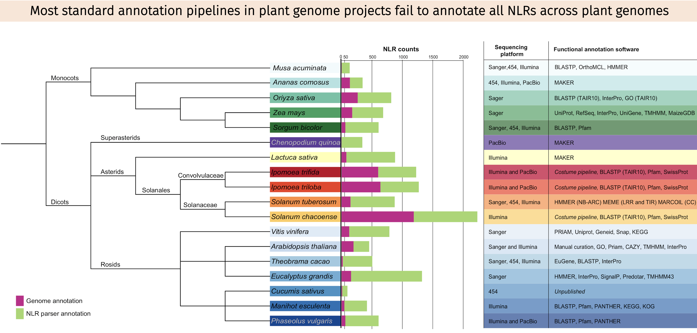
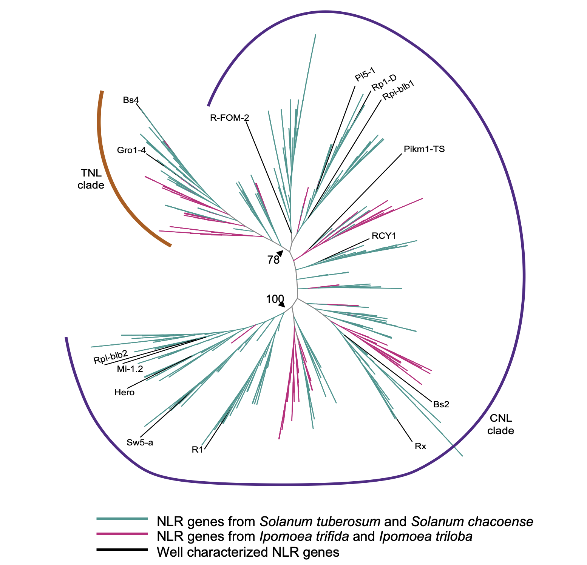

------

In a proof of concept study, we compared the original genome annotation of 18 plant species against the NLR-parser annotation output. 

 In general, we observed a pattern of misannotation of NLR genes across all 18 genomes compared here. Interestingly, wild relatives of sweetpotato (*I. trifida*, *I. triloba*) and white potato (*S. chacoense*) exhibited higher NLR counts in their respective genome annotation. Our comparative genome analysis emphasizes the need to improve sequencing, assembly, and annotation of the NLR gene family as critical for studies aiming to breed for resistance to plant pathogens. 

We built a phylogeny of complete NLRs from Solanaceae and Convolvulaceae sequenced genomes to test the relationship of NLRs in these two plant families. 

This phylogeny included 15 well-characterized NLRs from a curated [NLR database](https://pubmed-ncbi-nlm-nih-gov.prox.lib.ncsu.edu/23161682/). The coil-coiled NLRs also known as CNLs tend to dominate the phylogeny. Our NLR phylogeny confirms the existence of a well-supported superclade that includes functionally characterized NLRs, such as Rpi-blb2, Mi-1.2, Hero, Sw5-a, and R1, all of which confer resistance to diverse plant pathogens.Interestingly only one NLR from the Convolvulaceae belongs to that superclade, implying differences in how this gene family perhaps evolved in the Solanales order. This small phylogeny could potentially be improved with annotated NLRs from cultivated sweetpotato and used to study evolution of NLRs from diploid wild relatives to hexaploid or tetraploid cultivated sweetpotatoes and white potatoes respectively.

