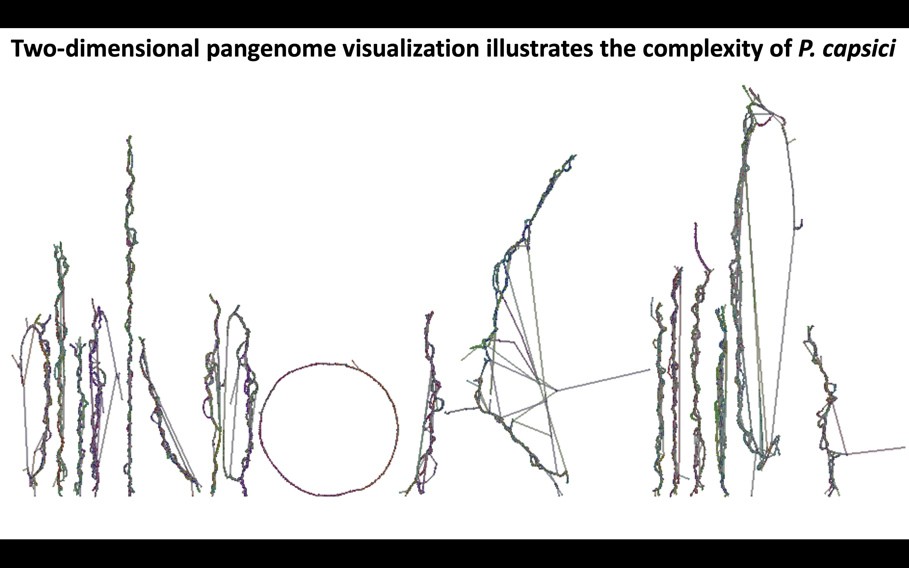

---

title: "Population Genomics of *P. capsici* in New York"
summary: "Genomic analysis of *Phytophthora capsici* isolates from New York for insights into population structure and fungicide resistance."
authors: [Camilo Parada]
tags: [Phytophthora, Genomics]
categories: [Phytophthora, Genomics]
date: 2025-01-15T08:00:20-07:00
lastmod: 2025-01-15T10:57:47+02:00

image:
  caption: ""
  focal_point: "Smart"
  preview_only: false

url_code: ""
url_pdf: ""
url_slides: ""
url_video: ""
featured: "true"

---

------

This project involves sequencing 10 *Phytophthora capsici* isolates, which serve as valuable resources for reference genomes and are being used to produce a biparental field population in New York. The idea is to be able to have good references that can be use in the future mapping of progeny isolates. 

In addition to their immediate utility, this project provided the opportunity to learn advanced techniques such as assembling telomere-to-telomere (T2T) genomes, creating pangenome graphs, and performing genome annotation. These analyses collectively contribute to understanding the genetic diversity and adaptive evolution of *P. capsici* populations, ensuring effective and sustainable management strategies.
