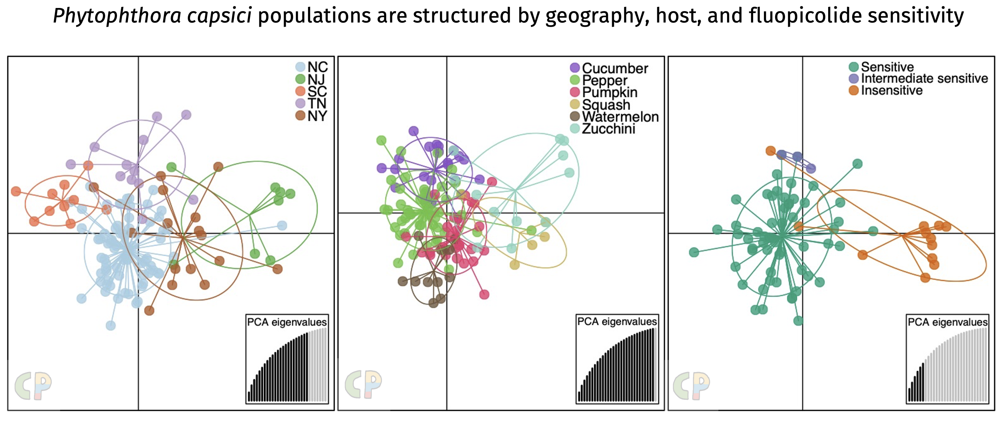

------

*Phytophthora capsici* epidemics are propelled by warm temperatures and wet conditions. With temperatures and inland flooding in many locations worldwide expected to rise as a result of global climate change, understanding of population structure can help to inform management of *P. capsici* in the field and prevent devastating epidemics. Thus, we investigated the effect of geographical oring, host crop, fungicide sensitivity and mating type on shaping the population structure of *P. capsici* in the eastern U.S.

