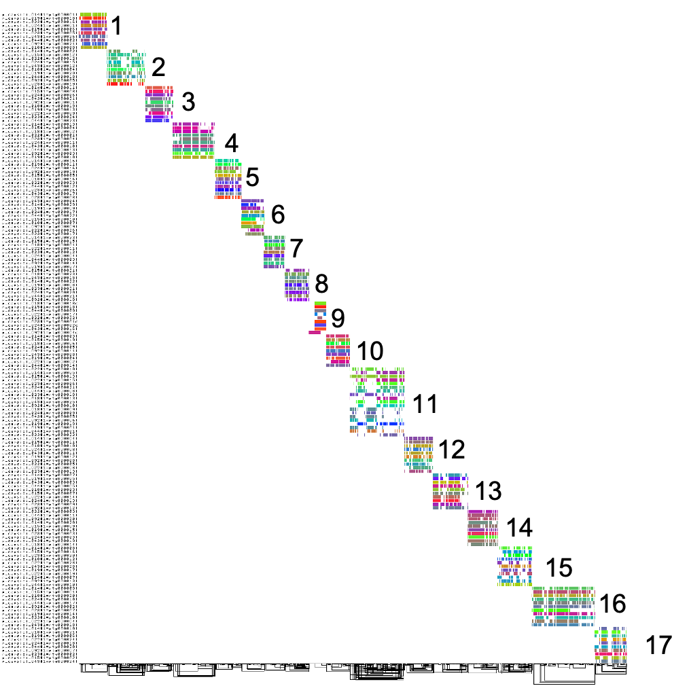

---

title: "Phylogenomics of *Phytophthora* Species"
summary: "High-quality genome sequencing and annotation of over 100 *Phytophthora* species for phylogenomic insights."
authors: [Camilo Parada]
tags: [Phytophthora, Genomics]
categories: [Phytophthora, Genomics]
date: 2025-01-15T08:00:20-07:00
lastmod: 2025-01-15T10:57:47+02:00

image:
  caption: ""
  focal_point: "Smart"
  preview_only: false

url_code: ""
url_pdf: ""
url_slides: ""
url_video: ""
featured: "true"

---

------

This project involves sequencing and annotating over 100 *Phytophthora* genomes to explore their phylogenomic relationships and diversity within this important genus. We focus on assembling high-quality genomes using long-read ONT data and ensuring robust annotations through collaborative efforts among postdoctoral researchers.

The data generated here will serve as a resource for understanding evolutionary patterns, population dynamics, and the mechanisms driving pathogenicity in *Phytophthora* species.
